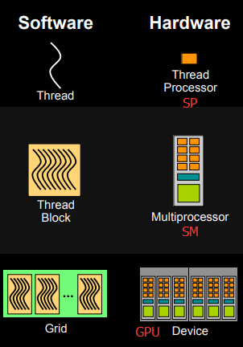
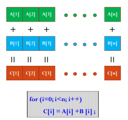
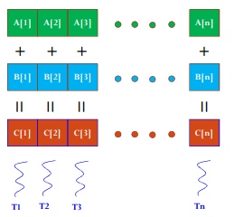
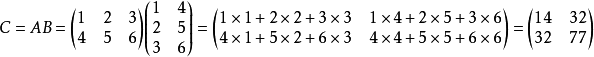
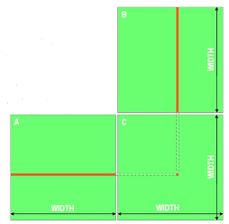
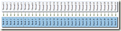
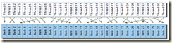
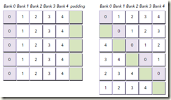
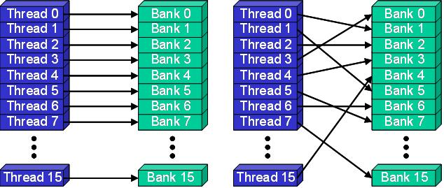
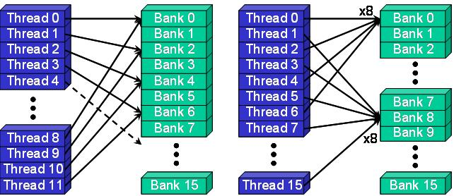

### 1、CUDA基本架构

#### 线程模型

CUDA的线程层次结构是一个两层的线程层次结构，由线程块和线程块网格组成，

##### 软件模型


相当于把GPU上的计算单元分为若干（2~3）个网格，每个网格内包含若干（65535）个线程块，每个线程块包含若干（512）个线程。

- **thread：一个CUDA的并行程序会被以许多个threads来执行。**

- **block：数个threads会被群组成一个block，同一个block中的threads可以同步，也可以通过shared memory通信,不同线程块内的线程不能协作。**

- **grid：一个grid有多个（Block）构成，一个block包含一组线程。**由一个kernel启动所产生的所有线程统称为一个网格（Grid），同一网格中的所有线程共享同全局内存空间。在一个grid中，我们通过以下两个坐标变量来定位一个线程， 
  （1）blockIdx：block在grid中ID号 
  （2）threadIdx：thread在block内的ID号 
  这些坐标变量是kernel函数中需要预初始化的内置变量。

当执行有一个核函数时，CUDA Runtime 为每个线程分配坐标变量blockIdx和threadIdx。基于这些坐标，我们将数据分配到不同的GPU线程上，然后并行处理所有的数据。

坐标变量blocIdx和threadIdx都是基于unit3定义的CUDA内置的向量类型，分别包含3个无符号的整数结构，可以通过x,y,z三个元素来进行索引。

grid和block都是定义为dim3类型的变量，dim3可以看成是包含三个无符号整数（x，y，z）成员的结构体变量，在定义时，缺省值初始化为1。因此grid和block可以灵活地定义为1-dim，2-dim以及3-dim结构，对于图中结构（主要水平方向为x轴），定义的grid和block如下所示，kernel在调用时也必须通过执行配置<<<grid, block>>>来指定kernel所使用的线程数及结构。

```
dim3 grid(3, 2);
dim3 block(5, 3);

kernel_fun<<< grid, block >>>(prams...);
```


##### 硬件模型

CUDA是一种典型的SIMT架构（单指令多线程）每个GPU都包含了很多的SM（streaming multiprocessor），所以GPU支持成百上千的线程并行执行。当一个kernel启动后，thread会被分配到这些SM中执行。大量的thread可能会被分配到不同的SM，同一个block中的threads必然在同一个SM中并行（SIMT）执行。每个thread拥有它自己的程序计数器和状态寄存器，并且用该线程自己的数据执行指令，这就是所谓的Single Instruction Multiple Thread。

- warp：GPU执行程序时的调度单位，目前cuda的warp的大小为32，同在一个warp的线程，以不同数据资源执行相同的指令,这就是所谓 SIMT

 一个SP(streaming Process)可以执行一个thread，但是实际上并不是所有的thread能够在同一时刻执行。Nvidia把32个threads组成一个warp，**warp是调度和运行的基本单元**。**warp中所有threads并行的执行相同的指令。一个warp需要占用一个SM运行，多个warps需要轮流进入SM**。由SM的硬件warp scheduler负责调度。一个GPU上resident thread最多只有 SM*warp个

- SP：最基本的处理单元，streaming processor，也称为CUDA core。最后具体的指令和任务都是在SP上处理的。GPU进行并行计算，也就是很多个SP同时做处理。
- SM：多个SP加上其他的一些资源组成一个streaming multiprocessor。也叫GPU大核，其他资源如：warp scheduler，register，shared memory等。SM可以看做GPU的心脏（对比CPU核心），register和shared memory是SM的稀缺资源。CUDA将这些资源分配给所有驻留在SM中的threads。因此，这些有限的资源就使每个SM中active warps有非常严格的限制，也就限制了并行能力。

需要指出，每个SM包含的SP数量依据GPU架构而不同，Fermi架构GF100是32个，GF10X是48个，Kepler架构都是192个，Maxwell都是128个。

简而言之，SP是线程执行的硬件单位，SM中包含多个SP，一个GPU可以有多个SM（比如16个），最终一个GPU可能包含有上千个SP。这么多核心“同时运行”，速度可想而知，这个引号只是想表明实际上，软件逻辑上是所有SP是并行的，但是物理上并不是所有SP都能同时执行计算（比如我们只有8个SM却有1024个线程块需要调度处理），因为有些会处于挂起，就绪等其他状态，这有关GPU的线程调度。

下面这个图将从硬件角度和软件角度解释CUDA的线程模型。



- 每个线程由每个线程处理器（SP）执行
- 线程块由多核处理器（SM）执行
- 一个kernel其实由一个grid来执行，一个kernel一次只能在一个GPU上执行

block是软件概念，一个block只会由一个sm调度，程序员在开发时，通过设定block的属性，告诉GPU硬件，我有多少个线程，线程怎么组织。而具体怎么调度由sm的warps scheduler负责，block一旦被分配好SM，该block就会一直驻留在该SM中，直到执行结束。一个SM可以同时拥有多个blocks，但需要序列执行。


##### 线程索引ID的计算

Grid和Block不同划分方式下线程索引ID的计算公式

1、 grid划分成1维，block划分为1维

```c++
int threadId = blockIdx.x *blockDim.x + threadIdx.x;  
```

2、 grid划分成1维，block划分为2维  

```c++
int threadId = blockIdx.x * blockDim.x * blockDim.y+ threadIdx.y * blockDim.x + threadIdx.x;  
```

3、 grid划分成1维，block划分为3维  

```c++
int threadId = blockIdx.x * blockDim.x * blockDim.y * blockDim.z  + threadIdx.z * blockDim.y * blockDim.x + threadIdx.y * blockDim.x + threadIdx.x;  
```

4、 grid划分成2维，block划分为1维  

```c++
int blockId = blockIdx.y * gridDim.x + blockIdx.x;  
int threadId = blockId * blockDim.x + threadIdx.x;  
```

5、 grid划分成2维，block划分为2维 

```c++
int blockId = blockIdx.x + blockIdx.y * gridDim.x;  
int threadId = blockId * (blockDim.x * blockDim.y) + (threadIdx.y * blockDim.x) + threadIdx.x;  
```

6、 grid划分成2维，block划分为3维

```c++
int blockId = blockIdx.x + blockIdx.y * gridDim.x;  
int threadId = blockId * (blockDim.x * blockDim.y * blockDim.z)  + (threadIdx.z * (blockDim.x * blockDim.y))  + (threadIdx.y * blockDim.x) + threadIdx.x;  
```

7、 grid划分成3维，block划分为1维 

```c++
int blockId = blockIdx.x + blockIdx.y * gridDim.x + gridDim.x * gridDim.y * blockIdx.z;  
int threadId = blockId * blockDim.x + threadIdx.x;  
```

8、 grid划分成3维，block划分为2维  

```c++
int blockId = blockIdx.x + blockIdx.y * gridDim.x  + gridDim.x * gridDim.y * blockIdx.z;  
int threadId = blockId * (blockDim.x * blockDim.y)  + (threadIdx.y * blockDim.x) + threadIdx.x;  
```

9、 grid划分成3维，block划分为3维

```c++
int blockId = blockIdx.x + blockIdx.y * gridDim.x  + gridDim.x * gridDim.y * blockIdx.z;  
int threadId = blockId * (blockDim.x * blockDim.y * blockDim.z)  + (threadIdx.z * (blockDim.x * blockDim.y))  + (threadIdx.y * blockDim.x) + threadIdx.x;  
```
#### 内存模型

GPU和CPU的主存都是用DRAM实现，cache则是用lower-latency的SRAM来实现。GPU和CPU的存储结构基本一样。但是CUDA将memory结构更好的呈现给用户，从而能更灵活的控制程序行为。CUDA中的内存模型分为以下几个层次：

- 每个线程都用自己的registers（寄存器）
- 每个线程都有自己的local memory（局部内存）
- 每个线程块内都有自己的shared memory（共享内存），所有线程块内的所有线程共享这段内存资源
- 每个grid都有自己的global memory（全局内存），不同线程块的线程都可使用
- 每个grid都有自己的constant memory（常量内存）和texture memory（纹理内存），不同线程块的线程都可使用

线程访问这几类存储器的速度是register > local memory >shared memory > global memory

下面这幅图表示就是这些内存在计算机架构中的所在层次。


##### Global Memory

global Memory是空间最大，latency最高，GPU最基础的memory。“global”指明了其生命周期。任意SM都可以在整个程序的生命期中获取其状态。global中的变量既可以是静态也可以是动态声明。可以使用**device**修饰符来限定其属性。global memory的分配就是之前频繁使用的cudaMalloc，释放使用cudaFree。global memory驻留在devicememory，可以通过32-byte、64-byte或者128-byte三种格式传输。这些memory transaction必须是对齐的，也就是说首地址必须是32、64或者128的倍数。优化memory transaction对于性能提升至关重要。当warp执行memory load/store时，需要的transaction数量依赖于下面两个因素：

- Distribution of memory addresses across the threads of that warp.
- Alignment of memory addresses per transaction.地址对齐

一般来说，所需求的transaction越多，潜在的不必要数据传输就越多，从而导致throughput efficiency降低。
   对于一个既定的warp memory请求，transaction的数量和throughput efficiency是由CC版本决定的。对于CC1.0和1.1来说，对于global memory的获取是非常严格的。而1.1以上，由于cache的存在，获取要轻松的多。


##### Shared Memory

​	用**shared**修饰符修饰的变量存放在shared memory。因为shared memory是on-chip的，他相比localMemory和global memory来说，拥有高的多bandwidth和低很多的latency。他的使用和CPU的L1cache非常类似，但是他是programmable的。
 按惯例，像这类性能这么好的memory都是有限制的，shared memory是以block为单位分配的，如果每个block占用的share memory过多，那么每个SM上驻留的blocks就少，active warp的数目也会减少。
 	不同于register，shared memory尽管在kernel里声明的，但是他的生命周期是伴随整个block，而不是单个thread。当该block执行完毕，所拥有的资源就会被释放，重新分配给别的block。
​	 shared memory是同一个block 中thread交流的基本方式。同一个block中的thread通过shared memory中的数据来相互合作。获取shared memory的数据前必须先用`__syncthreads()`同步。L1 cache和shared memory使用相同的64KB on-chip memory，我们也可以使用API来动态配置二者的大小。

我们可以动态或者静态的分配shared Memory，其声明即可以在kernel内部也可以作为全局变量。其标识符为：__shared__。

下面这句话静态的声明了一个2D的浮点型数组：shared__ float  tile[size_y][size_x];

如果在kernel中声明的话，其作用域就是kernel内，否则是对所有kernel有效。如果shared Memory的大小在编译器未知的话，可以使用extern关键字修饰，例如下面声明一个未知大小的1D数组：

extern __shared__  int  tile[];

由于其大小在编译器未知，我们需要在每个kernel调用时，动态的分配其shared memory，也就是最开始提及的第三个参数：

kernel<<<grid, block, isize * sizeof(int)>>>(...)

应该注意到，只有1D数组才能这样动态使用。


##### Constant memory

Constant Memory驻留在device Memory，并且使用专用的constant cache（per-SM）。该Memory的声明应该以`__connstant__`修饰。constant的范围是全局的，针对所有kernel，对于所有GPU其大小都是64KB。在同一个编译单元，constant对所有kernel可见。
 kernel只能从constant Memory读取数据，因此其初始化必须在host端使用下面的function调用：
 `cudaError_t cudaMemcpyToSymbol(const void* symbol, const void* src,size_t count);`
 这个function拷贝src指向的count个byte到symbol的地址，symbol指向的是在device中的global或者constant Memory。
 当一个warp中所有thread都从同一个Memory地址读取数据时，constant Memory表现最好。例如，计算公式中的系数。如果所有的thread从不同的地址读取数据，并且只读一次，那么constant Memory就不是很好的选择，因为一次读constant Memory操作会广播给所有thread知道。

##### Texture Memory

texture Memory实际上也是global Memory在一块，但是他有自己专有的只读cache。这个cache在浮点运算很有用，texture Memory是针对2D空间局部性的优化策略，所以thread要获取2D数据就可以使用texture Memory来达到很高的性能。

###### Local Memory

有时候，如果register不够用，那么就会使用local memory来代替这部分寄存器空间。除此外，下面几种情况，编译器可能会把变量放置在local memory：

- 编译期间无法确定值的本地数组
- 消耗太多寄存器的较大的结构体或数组
- 任何超过寄存器限制的变量

在local memory中的变量本质上跟global memory在同一块存储区。所以local memory有很高的latency和较低的bandwidth。在CC2.0以上，GPU针对local memory会有L1（per-SM）和L2（per-device）两级cache。

##### GPU Caches

跟CPU的cache一样，GPU cache也是non-programmable的。在GPU上包含以下几种cache：

- L1

- L2

- Read-only constant

- Read-only texture


每个SM都有一个L1 cache，所有SM共享一个L2 cache。二者都是用来缓存local和global memory的，当然也包括register spilling的那部分。在Fermi GPus 和 Kepler K40或者之后的GPU，CUDA允许我们配置读操作的数据是否使用L1和L2或者只使用L2。在CPU方面，memory的load/store都可以被cache。但是在GPU上，只有load操作会被cache，store则不会。每个SM都有一个只读constant cache和texture cache来提升性能。


#### 编程模型

常见的CUDA术语：


##### 怎么写一个能在GPU跑的程序或函数呢？

通过关键字就可以表示某个程序在CPU上跑还是在GPU上跑！如下表所示，比如我们用__global__定义一个kernel函数，就是CPU上调用，GPU上执行，注意__global__函数的返回值必须设置为void。


##### CPU和GPU间的数据传输怎么写？

在GPU内存分配回收内存的函数接口：

- cudaMalloc(): 在设备端分配global memory
- cudaFree(): 释放存储空间

CPU的数据和GPU端数据做数据传输的函数接口是一样的，他们通过传递的函数实参（枚举类型）来表示传输方向：

cudaMemcpy(void *dst, void* src, size_t nbytes,  enum cudaMemcpyKind direction)

enum cudaMemcpyKind:

- cudaMemcpyHostToDevice（CPU到GPU）
- cudaMemcpyDeviceToHost（GPU到CPU）
- cudaMemcpyDeviceToDevice（GPU到GPU）

##### 怎么用代码表示线程组织模型？

我们可以用dim3类来表示网格和线程块的组织方式，网格grid可以表示为一维和二维格式，线程块block可以表示为一维、二维和三维的数据格式。

```c++
dim3 DimGrid(100, 50);  //5000个线程块，维度是100*50
dim3 DimBlock(4, 8, 8);  //每个线层块内包含256个线程，线程块内的维度是4*8*8
```

##### 怎么计算线程号呢？

###### 1.使用N个线程块，每一个线程块只有一个线程，即

```c++
dim3 dimGrid(N);
dim3 dimBlock(1);
```

此时的线程号的计算方式就是

```
threadId = blockIdx.x;
```

其中threadId的取值范围为0到N-1。对于这种情况，我们可以将其看作是一个列向量，列向量中的每一行对应一个线程块。列向量中每一行只有1个元素，对应一个线程。

###### 2.使用M×N个线程块，每个线程块1个线程

由于线程块是2维的，故可以看做是一个M*N的2维矩阵，其线程号有两个维度，即：

```
dim3 dimGrid(M,N);
dim3 dimBlock(1);
```

其中

```
blockIdx.x 取值0到M-1
blcokIdx.y 取值0到N-1
```

这种情况一般用于处理2维数据结构，比如2维图像。每一个像素用一个线程来处理，此时需要线程号来映射图像像素的对应位置，如

```c++
pos = blockIdx.y * blcokDim.x + blockIdx.x; //其中gridDim.x等于M
```

###### 3.使用一个线程块，该线程具有N个线程，即

```
dim3 dimGrid(1);
dim3 dimBlock(N);
```

此时线程号的计算方式为

```
threadId = threadIdx.x;
```

其中threadId的范围是0到N-1，对于这种情况，可以看做是一个行向量，行向量中的每一个元素的每一个元素对应着一个线程。

###### 4.使用M个线程块，每个线程块内含有N个线程，即

```
dim3 dimGrid(M);
dim3 dimBlock(N);
```

这种情况，可以把它想象成二维矩阵，矩阵的行与线程块对应，矩阵的列与线程编号对应，那线程号的计算方式为

```
threadId = threadIdx.x + blcokIdx*blockDim.x;
```

上面其实就是把二维的索引空间转换为一维索引空间的过程。

###### 5.使用M×N的二维线程块，每一个线程块具有P×Q个线程，即

```
dim3 dimGrid(M, N);
dim3 dimBlock(P, Q);
```

这种情况其实是我们遇到的最多情况，特别适用于处理具有二维数据结构的算法，比如图像处理领域。

其索引有两个维度

```
threadId.x = blockIdx.x*blockDim.x+threadIdx.x;
threadId.y = blockIdx.y*blockDim.y+threadIdx.y;
```

上述公式就是把线程和线程块的索引映射为图像像素坐标的计算方法。

###2、 CUDA应用

#### 将两个元素数目为1024×1024的float数组相加

首先我们思考一下如果只用CPU我们怎么串行完成这个任务。



```c++
#include <iostream>
#include <stdlib.h>
#include <sys/time.h>
#include <math.h>
using namespace std;
int main()
{
    struct timeval start, end;
    gettimeofday( &start, NULL );
    float*A, *B, *C;
    int n = 1024 * 1024;
    int size = n * sizeof(float);
    A = (float*)malloc(size);
    B = (float*)malloc(size);
    C = (float*)malloc(size);

    for(int i=0;i<n;i++)
    {
        A[i] = 90.0;
        B[i] = 10.0;
    }
    
    for(int i=0;i<n;i++)
    {
        C[i] = A[i] + B[i];
    }

    float max_error = 0.0;
    for(int i=0;i<n;i++)
    {
        max_error += fabs(100.0-C[i]);
    }
    cout << "max_error is " << max_error << endl;
    gettimeofday( &end, NULL );
    int timeuse = 1000000 * ( end.tv_sec - start.tv_sec ) + end.tv_usec - start.tv_usec;
    cout << "total time is " << timeuse/1000 << "ms" <<endl;
    return 0;
}
```

CPU方式输出结果

```
max_error is 0
total time is 22ms
```

如果我们使用GPU来做并行计算，速度将会如何呢？



编程要点：

1. 每个Block中的Thread数最大不超过512；
2. 为了充分利用SM，Block数尽可能多，>100。

```c++
#include "cuda_runtime.h"
#include <stdlib.h>
#include <iostream>
#include <sys/time.h>

using namespace std;

__global__ void Plus(float A[], float B[], float C[], int n)
{
    int i = blockDim.x * blockIdx.x + threadIdx.x;
    C[i] = A[i] + B[i];
}

int main()
{
    struct timeval start, end;
    gettimeofday( &start, NULL );
    float*A, *Ad, *B, *Bd, *C, *Cd;
    int n = 1024 * 1024;
    int size = n * sizeof(float);

    // CPU端分配内存
    A = (float*)malloc(size);
    B = (float*)malloc(size);
    C = (float*)malloc(size);

    // 初始化数组
    for(int i=0;i<n;i++)
    {
        A[i] = 90.0;
        B[i] = 10.0;
    }

    // GPU端分配内存
    cudaMalloc((void**)&Ad, size);
    cudaMalloc((void**)&Bd, size);
    cudaMalloc((void**)&Cd, size);

    // CPU的数据拷贝到GPU端
    cudaMemcpy(Ad, A, size, cudaMemcpyHostToDevice);
    cudaMemcpy(Bd, B, size, cudaMemcpyHostToDevice);
    cudaMemcpy(Bd, B, size, cudaMemcpyHostToDevice);

    // 定义kernel执行配置，（1024*1024/512）个block，每个block里面有512个线程
    dim3 dimBlock(512);
    dim3 dimGrid(n/512);

    // 执行kernel
    Plus<<<dimGrid, dimBlock>>>(Ad, Bd, Cd, n);

    // 将在GPU端计算好的结果拷贝回CPU端
    cudaMemcpy(C, Cd, size, cudaMemcpyDeviceToHost);

    // 校验误差
    float max_error = 0.0;
    for(int i=0;i<n;i++)
    {
        max_error += fabs(100.0 - C[i]);
    }

    cout << "max error is " << max_error << endl;

    // 释放CPU端、GPU端的内存
    free(A);
    free(B);
    free(C);
    cudaFree(Ad);
    cudaFree(Bd);
    cudaFree(Cd);
    gettimeofday( &end, NULL );
    int timeuse = 1000000 * ( end.tv_sec - start.tv_sec ) + end.tv_usec - start.tv_usec;
    cout << "total time is " << timeuse/1000 << "ms" <<endl;
    return 0;
}
```

GPU方式输出结果

```
max error is 0
total time is 1278ms
```

由上面的例子看出，使用CUDA编程时我们看不到for循环了，因为CPU编程的循环已经被分散到各个thread上做了，所以我们也就看到不到for一类的语句。从结果上看，CPU的循环计算的速度比GPU计算快多了，原因就在于CUDA中有大量的内存拷贝操作（数据传输花费了大量时间，而计算时间却非常少），如果计算量比较小的话，CPU计算会更合适一些。

#### 矩阵加法

即对两个矩阵对应坐标的元素相加后的结果存储在第三个的对应位置的元素上。值得注意的是，这个计算任务采用了二维数组的计算方式，注意一下二维数组在CUDA编程中的写法。

CPU版本

```c++
#include <stdlib.h>
#include <iostream>
#include <sys/time.h>
#include <math.h>

#define ROWS 1024
#define COLS 1024

using namespace std;

int main()
{
    struct timeval start, end;
    gettimeofday( &start, NULL );
    int *A, **A_ptr, *B, **B_ptr, *C, **C_ptr;
    int total_size = ROWS*COLS*sizeof(int);
    A = (int*)malloc(total_size);
    B = (int*)malloc(total_size);
    C = (int*)malloc(total_size);
    A_ptr = (int**)malloc(ROWS*sizeof(int*));
    B_ptr = (int**)malloc(ROWS*sizeof(int*));
    C_ptr = (int**)malloc(ROWS*sizeof(int*));
    
    //CPU一维数组初始化
    for(int i=0;i<ROWS*COLS;i++)
    {
        A[i] = 80;
        B[i] = 20;
    }
    
    for(int i=0;i<ROWS;i++)
    {
        A_ptr[i] = A + COLS*i;
        B_ptr[i] = B + COLS*i;
        C_ptr[i] = C + COLS*i;
    }
    
    for(int i=0;i<ROWS;i++)
        for(int j=0;j<COLS;j++)
        {
            C_ptr[i][j] = A_ptr[i][j] + B_ptr[i][j];
        }
        
    //检查结果
    int max_error = 0;
    for(int i=0;i<ROWS*COLS;i++)
    {
        //cout << C[i] << endl;
        max_error += abs(100-C[i]);
    }
    
    cout << "max_error is " << max_error <<endl;     
    gettimeofday( &end, NULL );
    int timeuse = 1000000 * ( end.tv_sec - start.tv_sec ) + end.tv_usec - start.tv_usec;
    cout << "total time is " << timeuse/1000 << "ms" <<endl;
    
    return 0;
}
```

CPU方式输出

```
max_error is 0
total time is 29ms
```

GPU版本

```c++
#include "cuda_runtime.h"
#include "device_launch_parameters.h"
#include <sys/time.h> 
#include <stdio.h>
#include <math.h>
#define Row  1024
#define Col 1024
 
 
__global__ void addKernel(int **C,  int **A, int ** B)
{
    int idx = threadIdx.x + blockDim.x * blockIdx.x;
    int idy = threadIdx.y + blockDim.y * blockIdx.y;
    if (idx < Col && idy < Row) {
        C[idy][idx] = A[idy][idx] + B[idy][idx];
    }
}
 
int main()
{
    struct timeval start, end;
    gettimeofday( &start, NULL );

    int **A = (int **)malloc(sizeof(int*) * Row);
    int **B = (int **)malloc(sizeof(int*) * Row);
    int **C = (int **)malloc(sizeof(int*) * Row);
    int *dataA = (int *)malloc(sizeof(int) * Row * Col);
    int *dataB = (int *)malloc(sizeof(int) * Row * Col);
    int *dataC = (int *)malloc(sizeof(int) * Row * Col);
    int **d_A;
    int **d_B;
    int **d_C;
    int *d_dataA;
    int *d_dataB;
    int *d_dataC;
    //malloc device memory
    cudaMalloc((void**)&d_A, sizeof(int **) * Row);
    cudaMalloc((void**)&d_B, sizeof(int **) * Row);
    cudaMalloc((void**)&d_C, sizeof(int **) * Row);
    cudaMalloc((void**)&d_dataA, sizeof(int) *Row*Col);
    cudaMalloc((void**)&d_dataB, sizeof(int) *Row*Col);
    cudaMalloc((void**)&d_dataC, sizeof(int) *Row*Col);
    //set value
    for (int i = 0; i < Row*Col; i++) {
        dataA[i] = 90;
        dataB[i] = 10;
    }
    //将主机指针A指向设备数据位置，目的是让设备二级指针能够指向设备数据一级指针
    //A 和  dataA 都传到了设备上，但是二者还没有建立对应关系
    for (int i = 0; i < Row; i++) {
        A[i] = d_dataA + Col * i;
        B[i] = d_dataB + Col * i;
        C[i] = d_dataC + Col * i;
    }
                                                                
    cudaMemcpy(d_A, A, sizeof(int*) * Row, cudaMemcpyHostToDevice);
    cudaMemcpy(d_B, B, sizeof(int*) * Row, cudaMemcpyHostToDevice);
    cudaMemcpy(d_C, C, sizeof(int*) * Row, cudaMemcpyHostToDevice);
    cudaMemcpy(d_dataA, dataA, sizeof(int) * Row * Col, cudaMemcpyHostToDevice);
    cudaMemcpy(d_dataB, dataB, sizeof(int) * Row * Col, cudaMemcpyHostToDevice);
    dim3 threadPerBlock(16, 16);
    dim3 blockNumber( (Col + threadPerBlock.x - 1)/ threadPerBlock.x, (Row + threadPerBlock.y - 1) / threadPerBlock.y );
    printf("Block(%d,%d)   Grid(%d,%d).\n", threadPerBlock.x, threadPerBlock.y, blockNumber.x, blockNumber.y);
    addKernel << <blockNumber, threadPerBlock >> > (d_C, d_A, d_B);
    //拷贝计算数据-一级数据指针
    cudaMemcpy(dataC, d_dataC, sizeof(int) * Row * Col, cudaMemcpyDeviceToHost);
                                                                                             
    int max_error = 0;
    for(int i=0;i<Row*Col;i++)
    {
        //printf("%d\n", dataC[i]);
        max_error += abs(100-dataC[i]);
    }

    //释放内存
    free(A);
    free(B);
    free(C);
    free(dataA);
    free(dataB);
    free(dataC);
    cudaFree(d_A);
    cudaFree(d_B);
    cudaFree(d_C);
    cudaFree(d_dataA);
    cudaFree(d_dataB);
    cudaFree(d_dataC);

    printf("max_error is %d\n", max_error);
    gettimeofday( &end, NULL );
    int timeuse = 1000000 * ( end.tv_sec - start.tv_sec ) + end.tv_usec - start.tv_usec;
    printf("total time is %d ms\n", timeuse/1000);

    return 0;
}
```

GPU输出

```
Block(16,16)   Grid(64,64).
max_error is 0
total time is 442 ms
```

从结果看出，CPU计算时间还是比GPU的计算时间短。这里需要指出的是，这种二维数组的程序写法的效率并不高（虽然比较符合我们的思维方式），因为我们做了两次访存操作。所以一般而言，做高性能计算一般不会采取这种编程方式。

#### 矩阵乘法

两矩阵相乘，左矩阵第一行乘以右矩阵第一列（分别相乘，第一个数乘第一个数），乘完之后相加，即为结果的第一行第一列的数，依次往下算，直到计算完所有矩阵元素。



CPU版本

```c++
#include <iostream>
#include <stdlib.h>
#include <sys/time.h>

#define ROWS 1024
#define COLS 1024

using namespace std;

void matrix_mul_cpu(float* M, float* N, float* P, int width)
{
    for(int i=0;i<width;i++)
        for(int j=0;j<width;j++)
        {
            float sum = 0.0;
            for(int k=0;k<width;k++)
            {
                float a = M[i*width+k];
                float b = N[k*width+j];
                sum += a*b;
            }
            P[i*width+j] = sum;
        }
}

int main()
{
    struct timeval start, end;
    gettimeofday( &start, NULL );
    float *A, *B, *C;
    int total_size = ROWS*COLS*sizeof(float);
    A = (float*)malloc(total_size);
    B = (float*)malloc(total_size);
    C = (float*)malloc(total_size);

    //CPU一维数组初始化
    for(int i=0;i<ROWS*COLS;i++)
    {
        A[i] = 80.0;
        B[i] = 20.0;
    }

    matrix_mul_cpu(A, B, C, COLS);

    gettimeofday( &end, NULL );
    int timeuse = 1000000 * ( end.tv_sec - start.tv_sec ) + end.tv_usec - start.tv_usec;
    cout << "total time is " << timeuse/1000 << "ms" <<endl;

    return 0;
}
```

CPU输出

```
total time is 7617ms
```

梳理一下CUDA求解矩阵乘法的思路：因为C=A×B，我们利用每个线程求解C矩阵每个(x, y)的元素，每个线程载入A的一行和B的一列，遍历各自行列元素，对A、B对应的元素做一次乘法和一次加法。



GPU版本

```c++
#include "cuda_runtime.h"
#include "device_launch_parameters.h"
#include <sys/time.h> 
#include <stdio.h>
#include <math.h>
#define Row  1024
#define Col 1024

 
__global__ void matrix_mul_gpu(int *M, int* N, int* P, int width)
{
    int i = threadIdx.x + blockDim.x * blockIdx.x;
    int j = threadIdx.y + blockDim.y * blockIdx.y;
                
    int sum = 0;
    for(int k=0;k<width;k++)
    {
        int a = M[j*width+k];
        int b = N[k*width+i];
        sum += a*b;
    }
    P[j*width+i] = sum;
}
 
int main()
{
    struct timeval start, end;
    gettimeofday( &start, NULL );

    int *A = (int *)malloc(sizeof(int) * Row * Col);
    int *B = (int *)malloc(sizeof(int) * Row * Col);
    int *C = (int *)malloc(sizeof(int) * Row * Col);
    //malloc device memory
    int *d_dataA, *d_dataB, *d_dataC;
    cudaMalloc((void**)&d_dataA, sizeof(int) *Row*Col);
    cudaMalloc((void**)&d_dataB, sizeof(int) *Row*Col);
    cudaMalloc((void**)&d_dataC, sizeof(int) *Row*Col);
    //set value
    for (int i = 0; i < Row*Col; i++) {
        A[i] = 90;
        B[i] = 10;
    }
                                                                
    cudaMemcpy(d_dataA, A, sizeof(int) * Row * Col, cudaMemcpyHostToDevice);
    cudaMemcpy(d_dataB, B, sizeof(int) * Row * Col, cudaMemcpyHostToDevice);
    dim3 threadPerBlock(16, 16);
    dim3 blockNumber((Col+threadPerBlock.x-1)/ threadPerBlock.x, (Row+threadPerBlock.y-1)/ threadPerBlock.y );
    printf("Block(%d,%d)   Grid(%d,%d).\n", threadPerBlock.x, threadPerBlock.y, blockNumber.x, blockNumber.y);
    matrix_mul_gpu << <blockNumber, threadPerBlock >> > (d_dataA, d_dataB, d_dataC, Col);
    //拷贝计算数据-一级数据指针
    cudaMemcpy(C, d_dataC, sizeof(int) * Row * Col, cudaMemcpyDeviceToHost);
                                                                                             
    //释放内存
    free(A);
    free(B);
    free(C);
    cudaFree(d_dataA);
    cudaFree(d_dataB);
    cudaFree(d_dataC);

    gettimeofday( &end, NULL );
    int timeuse = 1000000 * ( end.tv_sec - start.tv_sec ) + end.tv_usec - start.tv_usec;
    printf("total time is %d ms\n", timeuse/1000);

    return 0;
}
```

GPU输出

```
Block(16,16)   Grid(64,64).
total time is 506 ms
```

### 3、Bank Conflict

#### Bank confict

当多个地址请求落在同一个bank中就会发生bank conflict，从而导致请求多次执行。硬件会把这类请求分散到尽可能多的没有conflict的那些传输操作 里面，降低有效带宽的因素是被分散到的传输操作个数。warp有三种典型的获取shared memory的模式：

· Parallel access：多个地址分散在多个bank。

· Serial access：多个地址落在同一个bank。

· Broadcast access：一个地址读操作落在一个bank。

Parallel access是最通常的模式，这个模式一般暗示，一些（也可能是全部）地址请求能够被一次传输解决。理想情况是，获取无conflict的shared memory的时，每个地址都在落在不同的bank中。

Serial access是最坏的模式，如果warp中的32个thread都访问了同一个bank中的不同位置，那就是32次单独的请求，而不是同时访问了。

Broadcast access也是只执行一次传输，然后传输结果会广播给所有发出请求的thread。这样的话就会导致带宽利用率低。

下图是最优情况的访问图示：

[](http://images0.cnblogs.com/blog/657339/201506/281419579866314.png)

下图一种随机访问，同样没有conflict：

[](http://images0.cnblogs.com/blog/657339/201506/281420050332095.png)

下图则是某些thread访问到同一个bank的情况，这种情况有两种行为：

· Conflict-free broadcast access if threads access the same address within a bank

· Bank conflict access if threads access different addresses within a bank

[](http://images0.cnblogs.com/blog/657339/201506/281420060499151.png)


#### share_memory里的memory Bank和bank Conflict（bank冲突）是什么意思，bank冲突如何避免？

CUDA 装置中，每个 multiprocessor 有 16KB 的 shared memory。Shared memory 分成16 个 bank。如果同时每个 thread 是存取不同的 bank，就不会产生任何问题，存取 shared memory 的速度和存取寄存器相同。不过，如果同时有两个（或更多个） threads 存取同一个bank 的数据，就会发生 bank conflict，这些 threads 就必须照顺序去存取，而无法同时存取shared memory 了。

解决方法：可以透过修改数据存放的方式

1. 尽量按行操作，需要按列操作时可以先对矩阵进行转置；

2. 划分子问题时，使每个block处理的问题宽度恰好为16的整数倍，使得访存可以按照 s_data[tid]=i_data[tid]的形式进行；

3. 使用对齐的数据格式，尽量使用nvidia定义的格式如float3,int2等，这些格式本身已经对齐；

4. 当要处理的矩阵宽度不是16的整数倍时，将其补为16的整数倍，或者用malloctopitch而不是malloc；

5. 利用广播。例如：s_odata[tid] = tid%16 < 8 ? s_idata[tid] : s_idata[15];会产生8路的块访问冲突，

而用：s_odata[tid]=s_idata[15];s_odata[tid]= tid%16 < 8 ? s_idata[tid] : s_data[tid]; 则不会产生块访问冲突。

6.通过额外的一行，可以避免 bank conflict，运行时间与完全没有 bank conflict 的运行时间差距很小。存在 bank conflict 的，运行时间几乎是没有 bank conflict 的运行时间的 4 倍。其实只要添加的是奇数列就可以，只不过 1 列是最节省空间（共享内存太宝贵）的。memory padding是一种避免bank conflict的方法，如下图所示，所有的thread分别访问了bank0的五个不同的word，这时就会导致bank conflict，我们采取的方法就是在每N（bank数目）个word后面加一个word，这样就如下面右图那样，原本bank0的每个word转移到了不同的bank中，从而避免了bank conflict。

[](http://images0.cnblogs.com/blog/657339/201506/281420140493774.png)

增加的这写word不会用来存储数据，其唯一的作用就是移动原始bank中的word，使用memory padding会导致block可获得shared memory中有用的数量减少。还有就是，要重新计算数组索引来获取正确的数据元素。

#### 为什么 shared memory 存在 bank  conflict，而 global memory 不存在？

因为访问 global memory 的只能是 block，而访问 shared memory 的却是同一个 half-warp 中的任意线程。

共享存储器被组织为16个bank，每个bank拥有32bit的宽度。一个warp中的线程对共享存储器的访问请求会被划分为两个half-warp的访问请求。无 bank conflict 时，一个half-warp内的线程可以在一个内核周期中并行访问对同一 bank 的同时访问导致 bank conflict 只能顺序处理,访存效率降低。如果half-warp的线程访问同一地址时，会产生一次广播，不会产生 bank conflict。






__shared__ float shared[256];
float foo = shared[threadIdx.x];
没有访问冲突

__shared__ float shared[256];
float foo = shared[threadIdx.x * 2];
产生2路访问冲突

__shared__ float shared[256];
float foo = shared[threadIdx.x*8];
产生8路访问冲突

书上说：“每个 bank 的宽度固定为 32 bit，相邻的 32 bit 字被组织在相邻的 bank 中，每个 bank 在每个时钟周期可以提供 32 bit 的带宽。”将 shared memory 看成一个二维存储空间，每个 bank 就是一列，每一行就是 16（或 32）个 banks。要么，尽量让一个 half-warp（或 full warp）中的线程分散访问不同列（即访问不同的 bank，同行不同行没有关系）；要么，让一个 half-warp（或 full warp）中的线程务必全部访问同一列且同一行（即访问同一个地址，仅对读操作有效）。

对于计算能力 1.0 的设备，前个 half-warp 和 后个 half-warp 不存在 bank conflict；
对于计算能力 2.0 的设备，前个 half-warp 和 后个 half-warp 可能存在 bank conflict，因为 shared memory 可以同时让 32 个 bank 响应请求；

如果是写操作，一个 half-warp（或 full warp） 中所有线程访问同一地址的时候，此时会产生不确定的结果（也只需要一个 clock cycle，不确定哪个线程会胜出），发生这种情况时应使用原子操作——但是原子操作对性能影响太大。

只要是多个线程访问同一地址都可以产生一次广播，多个线程访问同一地址将有效减少 bank conflict 的数量。若 half-warp（或 full warp） 中所有线程都要访问同一地址，则完全没有 bank conflict。  

